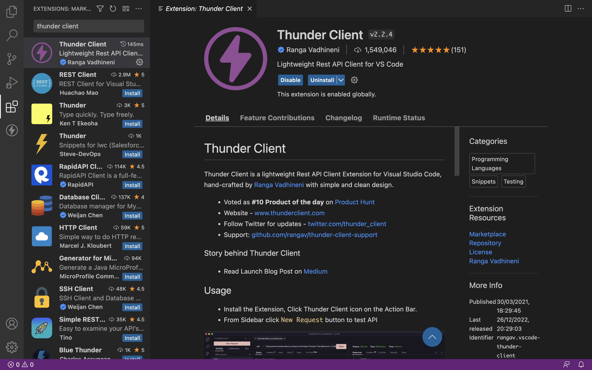
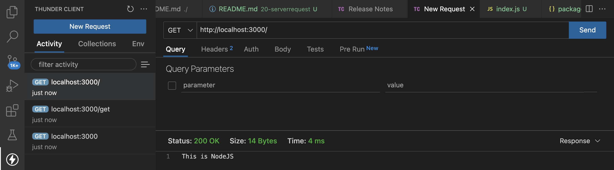
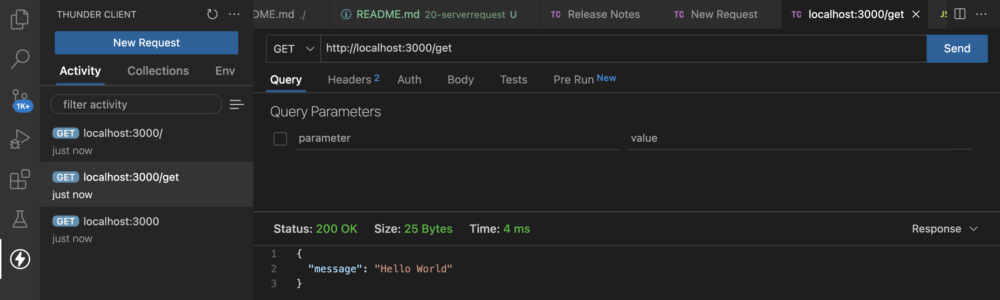
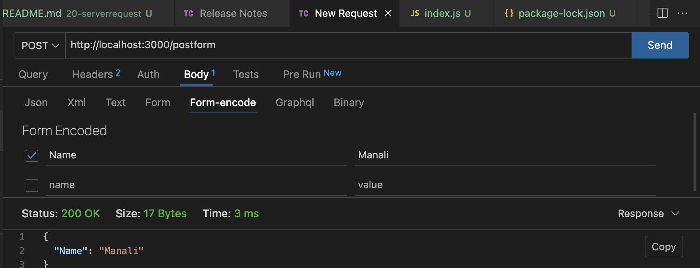

# Server Request

## Install Node.js
1. click on [Link](https://nodejs.org/en/). The Version used is `https://nodejs.org/dist/v19.3.0/node-v19.3.0.pkg`

2. node.js version

```
>> node -v
v19.3.0
```

## Start Server
1. Start Node.js Server

```
cd nodeJs
npm install
npm start
```

2. Access the application over `http://localhost:3000`.

## Install Thunder Client on VSCode
Go to extentions and search for `Thunder Client` and then install it.

### Thunder Client Extention


### Get Request


### Get Request with Path


### Post Request


# SERVER REQUEST

[serverrequest](https://pkg.go.dev/net/http)
[strings.builder](https://pkg.go.dev/strings#example-Builder)

This is `serverrequest` go code and I am using Visual Studio WSL[Ubuntu] for performing practical. I have installed `go` Extension in visual studio.

1. this command will generate a `go.mod` file.

```
go mod init serverrequest
```

while writing code if VS Code is showing install tools related to go then click on install.

2. Run `main.go` file by using.

```
go run main.go
```

## Output

```
Server Request
Status Code :  200
Content Length :  25
ByteCount :  25
{"message":"Hello World"}
```

