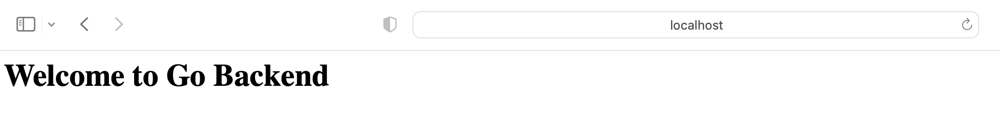
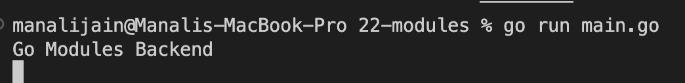
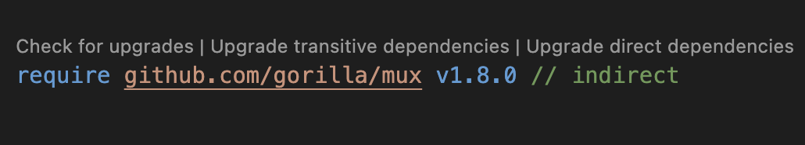
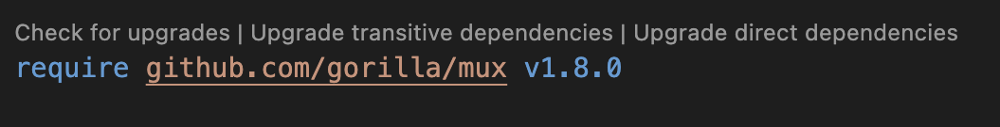

# MODULES

[MODULES](https://go.dev/blog/using-go-modules)

This is `Modules` go code and I am using Visual Studio Code for performing practical. I have installed `go` Extension in visual studio.
while writing code if VS Code is showing install tools related to go then click on install.

[SemanticVersioning](https://www.geeksforgeeks.org/introduction-semantic-versioning/)

[GoModulesReference](https://go.dev/ref/mod)

[GorillaMux](https://pkg.go.dev/github.com/gorilla/mux)

1. this command will generate a `go.mod` file.

```
go mod init github.com/manali1230/modules
```

2. Get gorilla mux and it will generate `go.sum` file and append data in `go.mod`

```
>> go get -u github.com/gorilla/mux
go: downloading github.com/gorilla/mux v1.8.0
go: added github.com/gorilla/mux v1.8.0
```

`go env` will show the go environment variables which also shows where all packages are present `GOPATH`.

for me gorilla/mux library is present at `/Users/manali/go/pkg/mod/cache/download/github.com/gorilla`.

3. Run `go build .` in directory `22-modules`.

```
go build .
```

4. Run `main.go` file.

```
go run main.go
```

## Output




5. Run `go mod tidy` to use `mux` version directly.

Before `go mod tidy`


After `go mod tidy`
