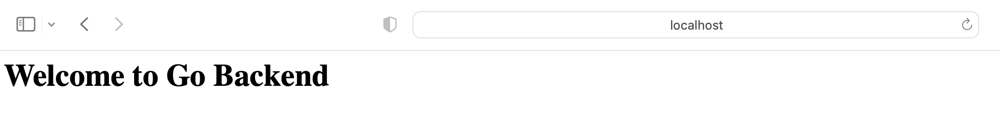
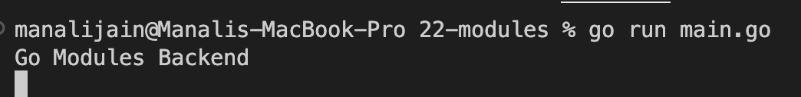
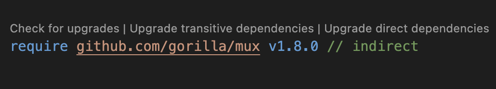
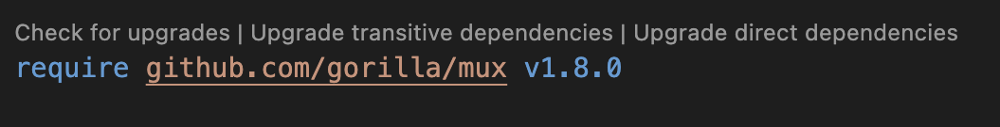

# MODULES

[MODULES](https://go.dev/blog/using-go-modules)

This is `Modules` go code and I am using Visual Studio Code for performing practical. I have installed `go` Extension in visual studio.
while writing code if VS Code is showing install tools related to go then click on install.

[SemanticVersioning](https://www.geeksforgeeks.org/introduction-semantic-versioning/)

[GoModulesReference](https://go.dev/ref/mod)

[GorillaMux](https://pkg.go.dev/github.com/gorilla/mux)

1. this command will generate a `go.mod` file.

```
go mod init github.com/manali1230/modules
```

2. Get gorilla mux and it will generate `go.sum` file and append data in `go.mod`

```
>> go get -u github.com/gorilla/mux
go: downloading github.com/gorilla/mux v1.8.0
go: added github.com/gorilla/mux v1.8.0
```

`go env` will show the go environment variables which also shows where all packages are present `GOPATH`.

for me gorilla/mux library is present at `/Users/manali/go/pkg/mod/cache/download/github.com/gorilla`.

3. Run `go build .` in directory `22-modules`.

```
go build .
```

4. Run `main.go` file.

```
go run main.go
```

## Output
Frontend - 


Backend - 


5. Run `go mod tidy` to use `mux` version directly.

Before `go mod tidy`


After `go mod tidy`


6. verify modules

```
>> go mod verify
all modules verified
```

7. list modules

```
go list
```

```
go list all
```

```
go list -m all
```

8. list versions of module

```
>> go list -m -versions github.com/gorilla/mux
github.com/gorilla/mux v1.2.0 v1.3.0 v1.4.0 v1.5.0 v1.6.0 v1.6.1 v1.6.2 v1.7.0 v1.7.1 v1.7.2 v1.7.3 v1.7.4 v1.8.0
```

9. show which mod is dependent on gorilla/mux

```
go mod why github.com/gorilla/mux
```

10. left modules dependent on right modules

```
go mod graph
```

11. changes go version in `go.mod` file
```
go mod edit -go 1.17
```

12. changes module name in `go.mod` file
```
go mod edit -module module
```

13. first check modules locally and not on web
```
go mod vendor 
```

```
go run -mod=vendor main.go
```