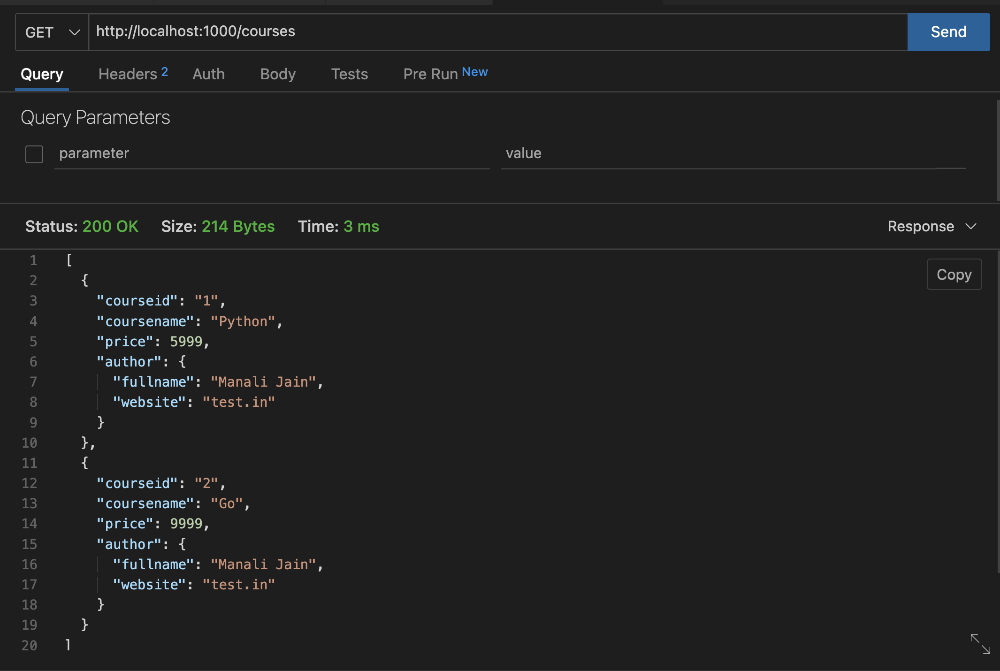

# API

[API](https://go.dev/doc/tutorial/web-service-gin)

This is `API` go code and I am using Visual Studio Code for performing practical. I have installed `go` Extension in visual studio.
while writing code if VS Code is showing install tools related to go then click on install.

[SemanticVersioning](https://www.geeksforgeeks.org/introduction-semantic-versioning/)

[GoModulesReference](https://go.dev/ref/mod)

[GorillaMux](https://pkg.go.dev/github.com/gorilla/mux)

1. this command will generate a `go.mod` file.

```
go mod init github.com/manali1230/api
```

2. get gorilla/mux module

```
>> go get -u github.com/gorilla/mux
go: added github.com/gorilla/mux v1.8.0
```

3. build api

```
go build .
```

4. run go

```
>> go run main.go 
CRUD OPERATIONS
```
5. hit the url `http://localhost:1000` and get the result .


api call in thunder client


### Operations output

1. Get list of all courses available.



2. Get only one course


3. Create one course


check course created or not


4. Update one course


check course updated or not


5. Delete one course


check course deleted or not\

