# MONGODB

[MONGODB](https://go.mongodb.org)

This is `MONGODB` go code and I am using Visual Studio Code for performing practical. I have installed `go` Extension in visual studio.
while writing code if VS Code is showing install tools related to go then click on install.

[SemanticVersioning](https://www.geeksforgeeks.org/introduction-semantic-versioning/)

[GoModulesReference](https://go.dev/ref/mod)

[GorillaMux](https://pkg.go.dev/github.com/gorilla/mux)

1. this command will generate a `go.mod` file.

```
go mod init github.com/manali1230/mongoapi
```

2. get gorilla/mux module

```
>> go get -u github.com/gorilla/mux
go: added github.com/gorilla/mux v1.8.0
```

3. get [mongodb](https://github.com/mongodb/mongo-go-driver) driver

```
go get go.mongodb.org/mongo-driver/mongo
```

4. Signup to [mongodb](https://www.mongodb.com)

Create shared cluster - 

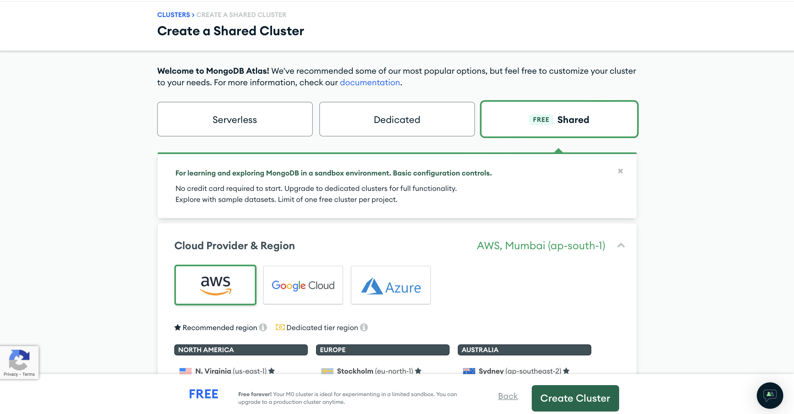

MongoDB Database - 

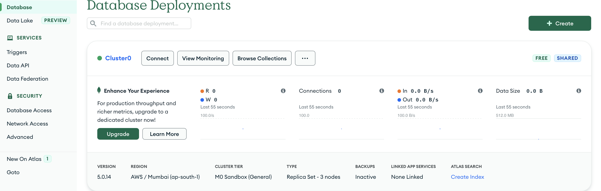

## Update Go Tools
In Visual Studio press `command + shift + P` then select `GO: Install/Update Tools` >> select the required one and press `enter` or click `ok`.

## Build
Build go by following command - 

```
go build main.go
```

## Run
Run go by following command - 

```
go run main.go
```

## Thunder Client Requests

1. Post Method

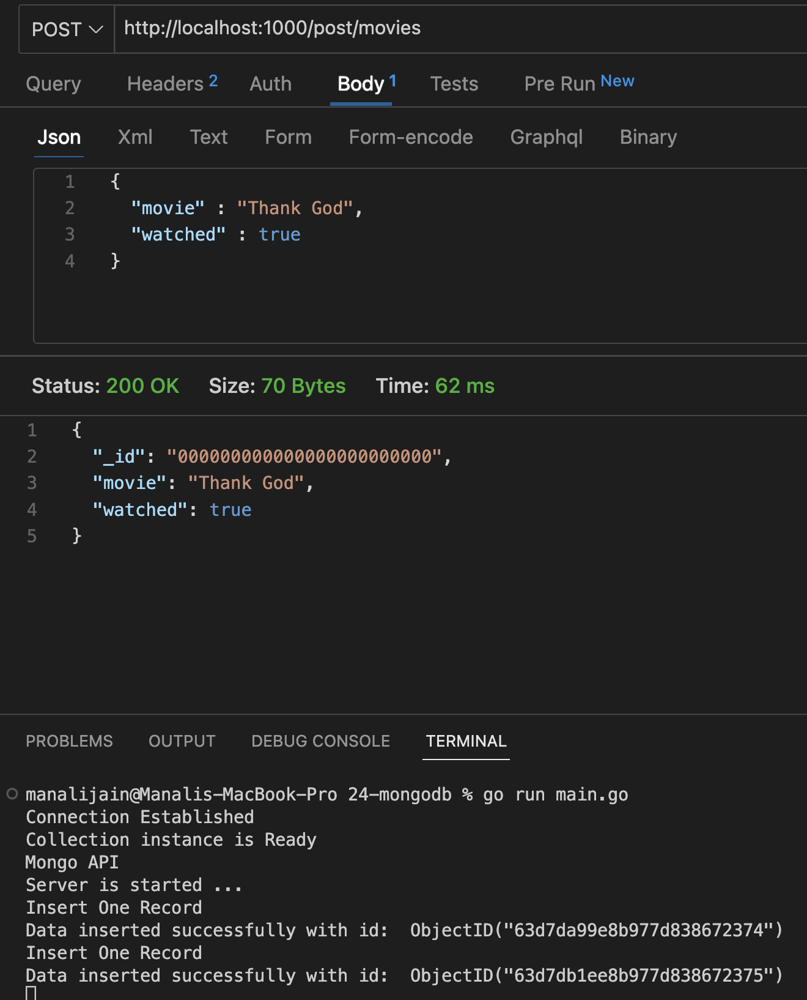

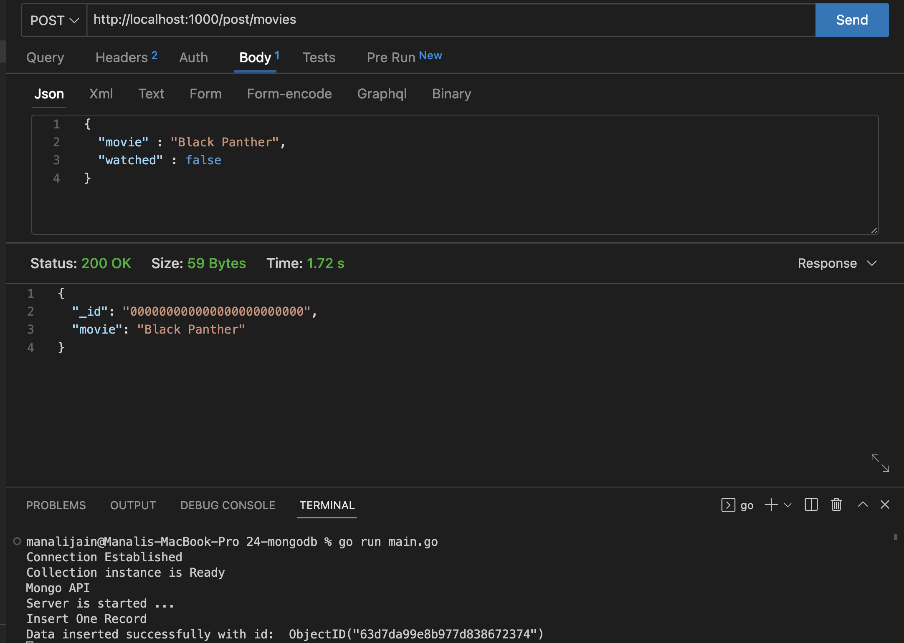

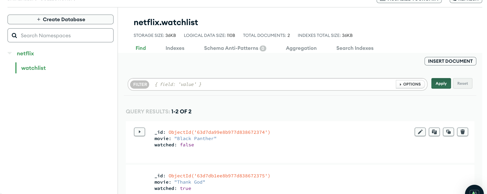

2. Put Method

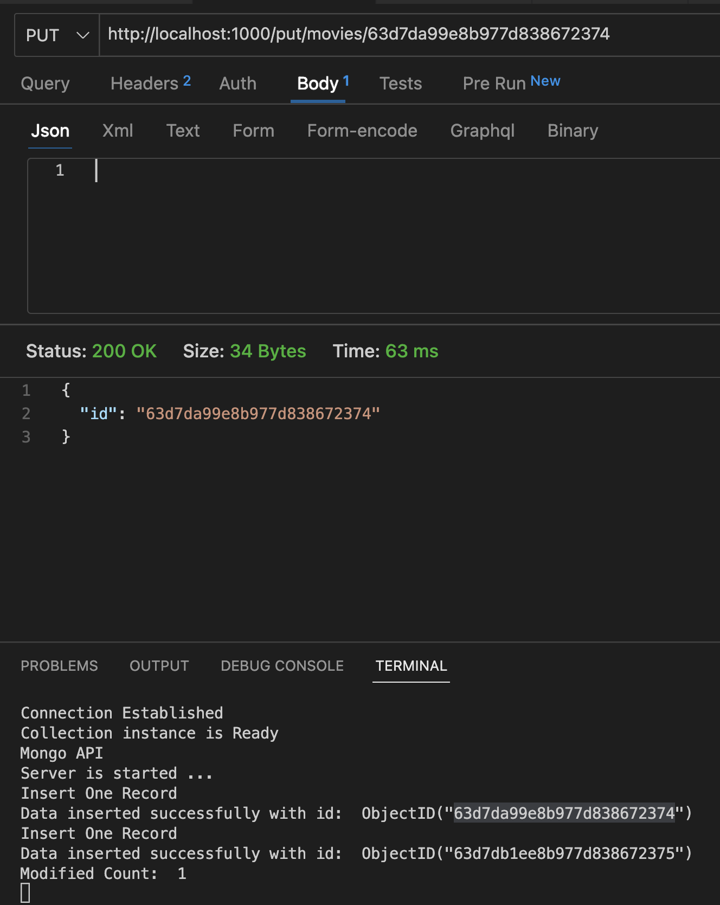

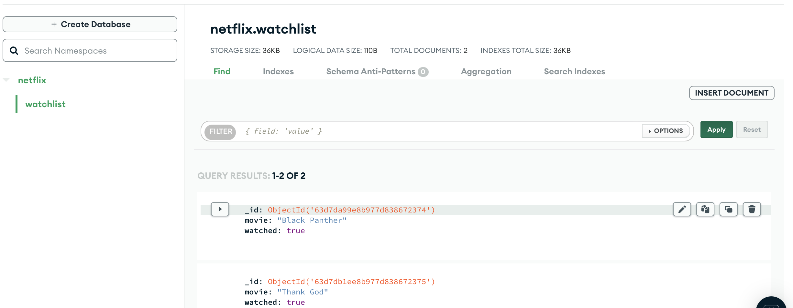

3. Delete Method

Delete A Movie

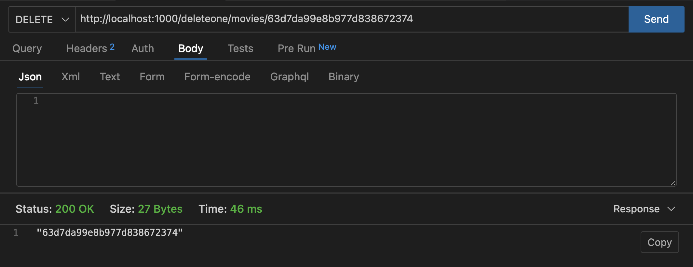

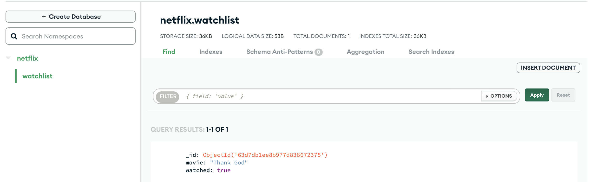

Delete All Movies

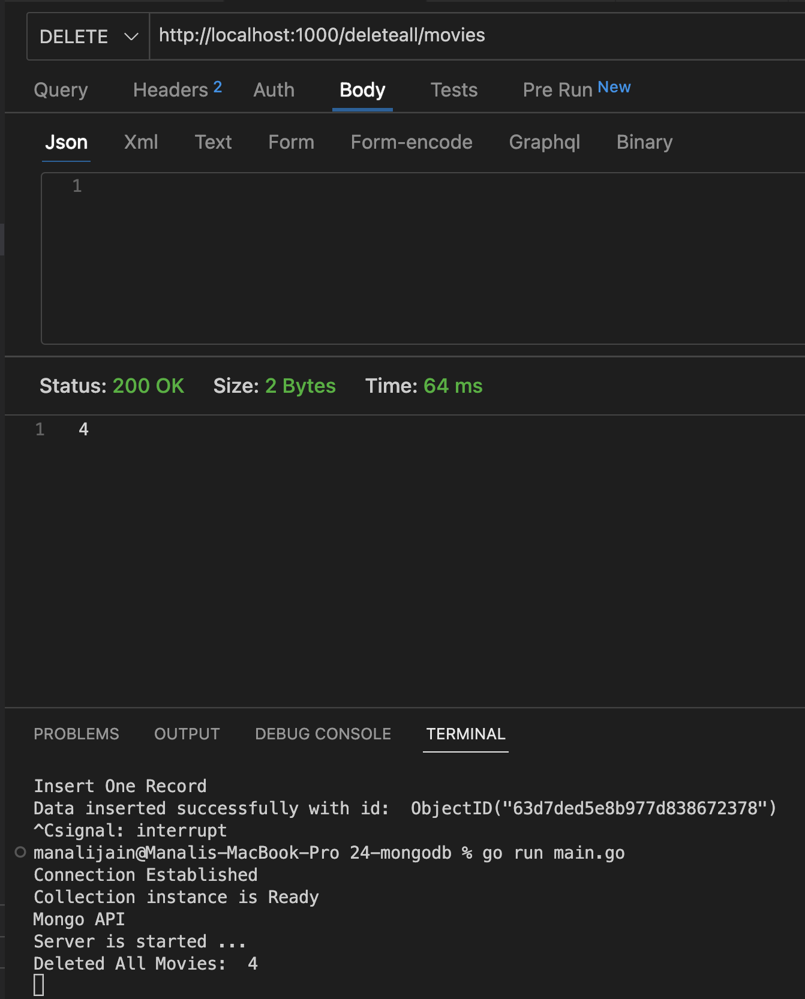

4. Get Method

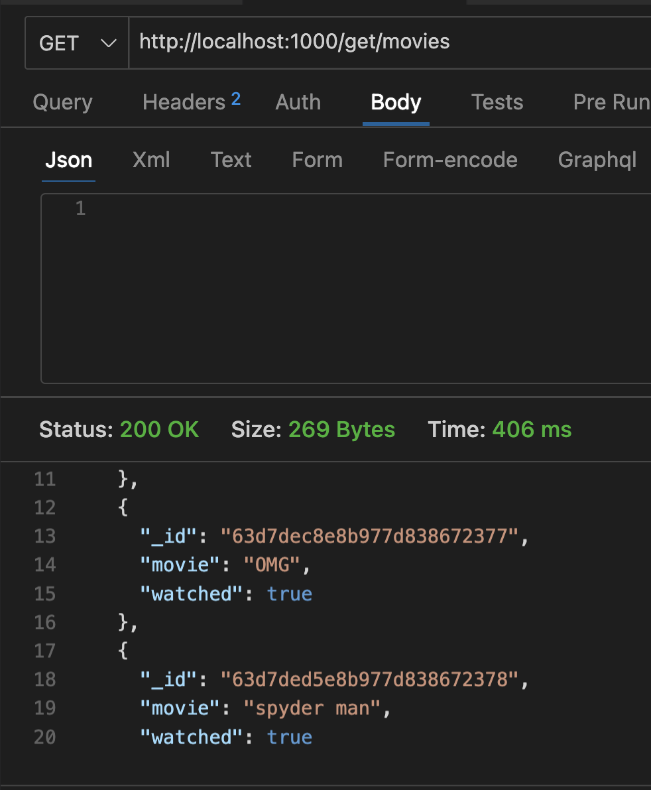
